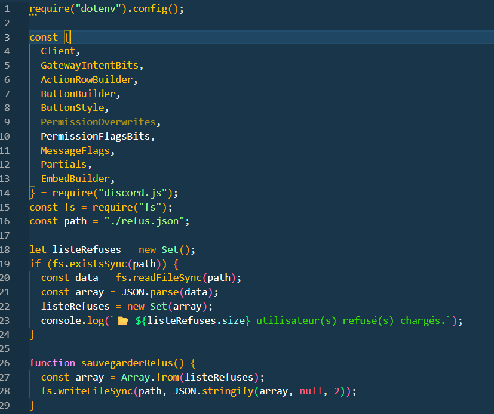
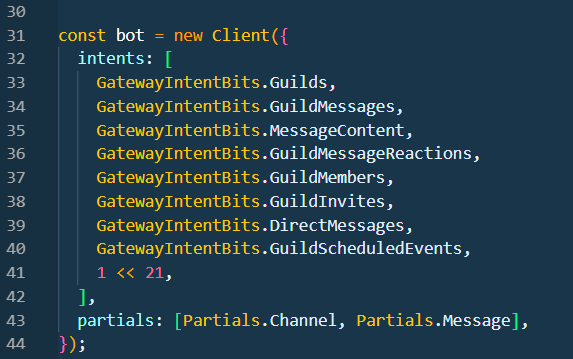

# Bot Discord - EPSI Bordeaux

Création d'un bot discord de modération sur un discord communautaire. Gestion des droits, des utilisateurs, catégorisation automatique des utilisateurs, modération des messages, gestion des événements et gestion dynamiques de salons textuels.


## Fonctionnalités principales

* **Gestion des droits :** Mise en place des droits pour les itervenants, les étudiants et ce qui sont en recherche d'entreprise.
* **Categorisation automatique :** Les utilisateurs seront répartit par promo pour avoir des droits.
* **Gestion des événements et dynamiques :** Mise en place de la gestions des événement par les modérateur, et de la création des salons textuels pour les intervenants.


## Technologies utilisées

* [Node.js](https://nodejs.org/) (Environnement d'exécution)
* [Discord.js v14](https://discord.js.org/) (Bibliothèque principale)
* [File System (fs)](https://nodejs.org/api/fs.html) (Pour la gestion de la persistance des refus)


## Installation

1. Installez les dépendances :

```bash
npm i --save discord.js
```
```bash
npm list discord.js (il faut que ce soit la version 14.25.1)
```

2. Clonez le projet :

```bash
git clone [https://github.com/Nicolaslombard31/bot_discord/tree/dev](https://github.com/Nicolaslombard31/bot_discord/tree/dev)
```

3. Créez un fichier .env à la racine et ajoutez vos clés :

```bash
DISCORD_TOKEN='Mettez votre Token ici'
Id_SERVER='Mettez votre id de votre serveur ici'
ID_SALON_RULES='Mettez votre id du salon des rôles ici'
ID_SALON_ADMIN='Mettez votre id du salon des admins ici'
ID_ROLE_ADMIN='Mettez votre id du role admin ici'
ID_SALON_REGLE='Mettez votre id du salon des règles ici'
ID_SALON_RE='Mettez votre id du salon RE ici'
INVITE_CODE_SPECIAL="Mettez votre id du lien d'invitation pour les RE ici"
ID_SALON_QUESTIONS='Mettez votre id du salon des questions ici'
ID_SALON_ANNONCE='Mettez votre id du salon des annonces ici'
```

4. Lancez le bot :

```bash
node .\index.js
```


## Infrastructure

1. Implementation :

Le code ci-dessous reprèsente toutes les implémentations pour permettre au code d'utilisé les outils pour faire fonctionner mon bot.


