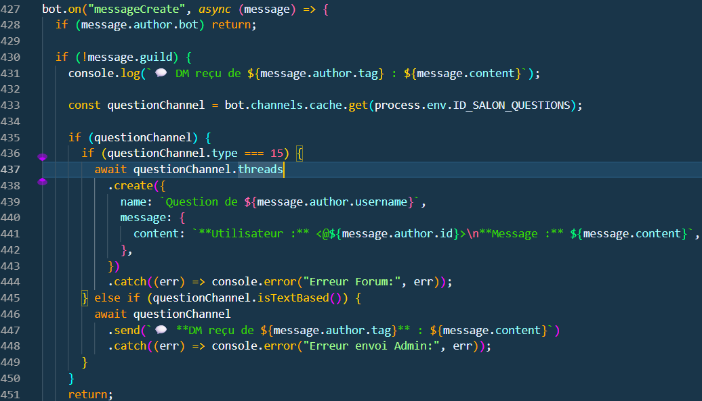
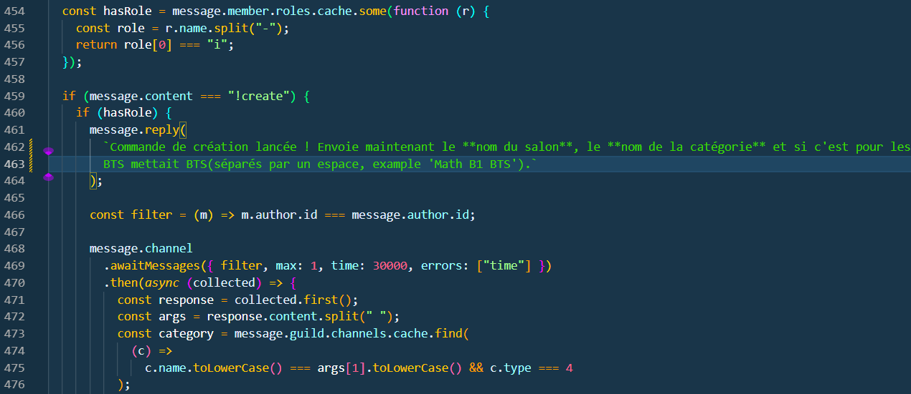
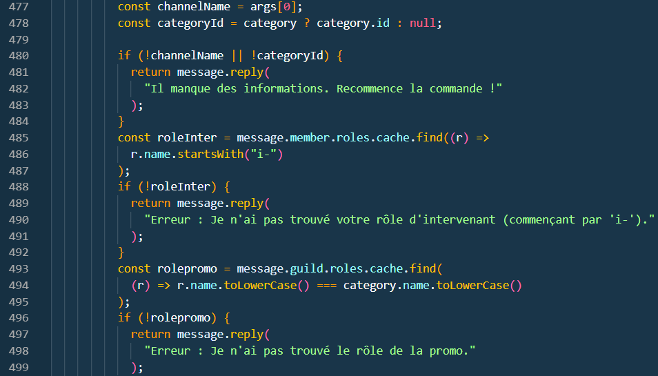
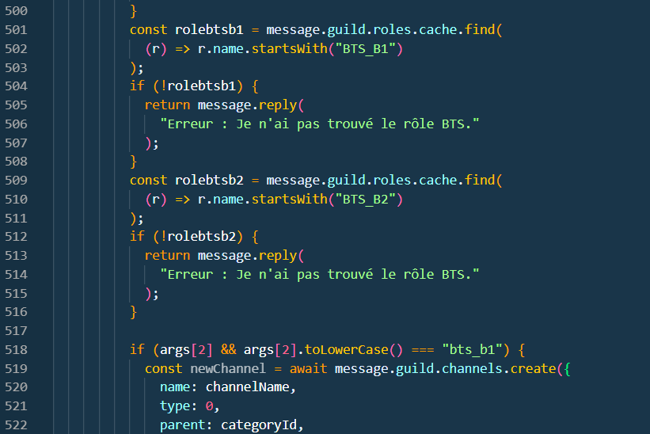
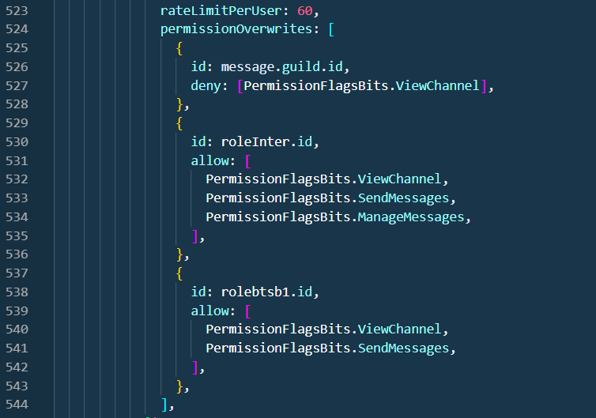
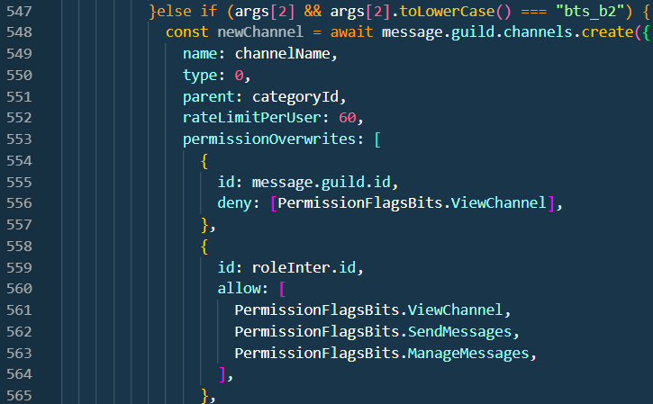
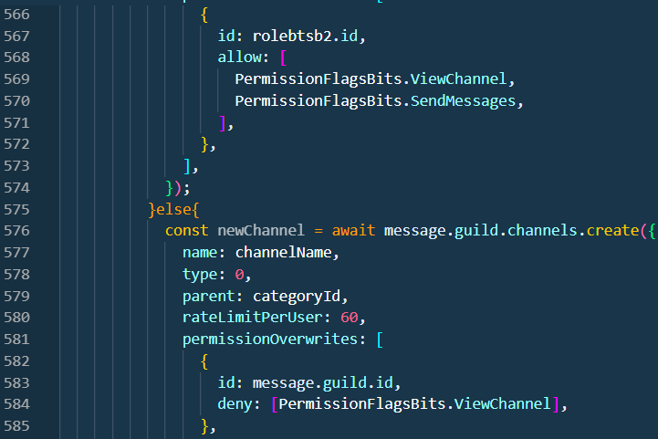
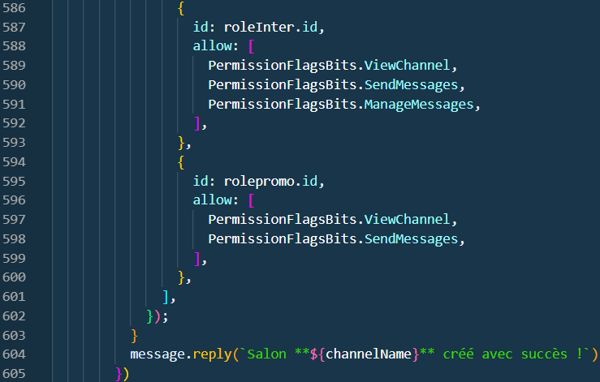
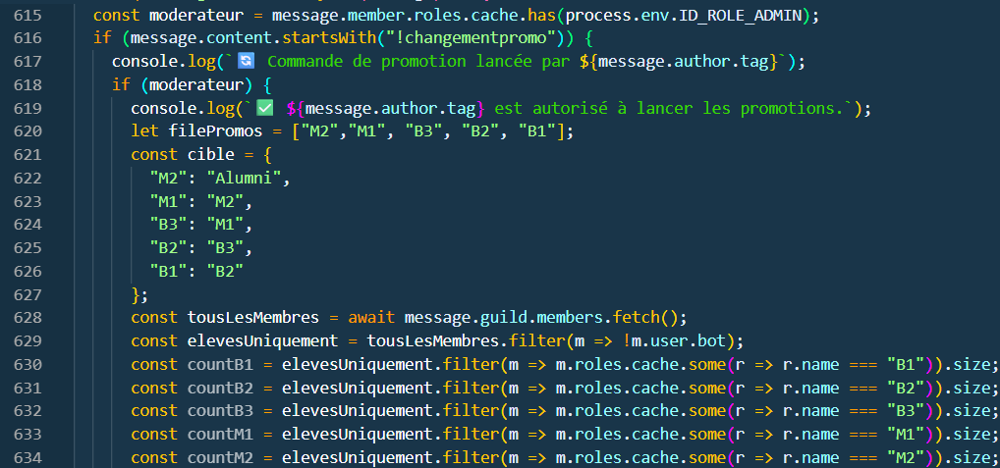
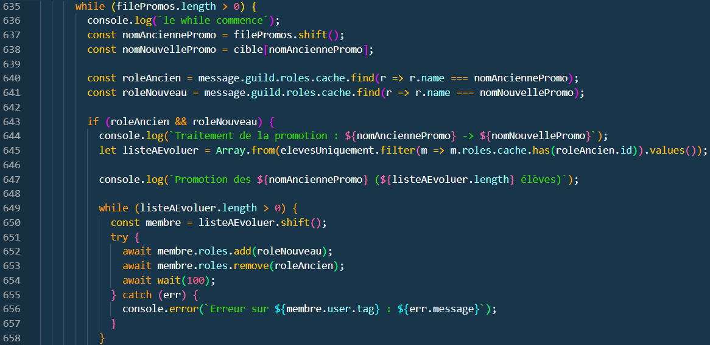

# Création

[page précédente](../dossier_technique/reactions.md)   [🏠](../README.md)   [page suivante](../dossier_technique/interaction.md)

## 1. Création de forum :

Nous allons voir grâçe a ce bout de code comment un user peut créer un forum depuis son DM (Messsage Privée) avec le bot.

## 2. Création de Salon par un Intervenant :

La suite du code nous permet de lancer la création d'un salon vu uniquement par une promo et l'intervenant qui la crée grâçe a la commande **"!create"**.

## 3. Changement de Promo

Dans le code qui vas suivre nous avons fait une imbrication de condition pour vérifier si c'est bien la bonne commande et si la personne qui l'utilise est autorisé a le faire. Cette commande permet au administrateur de faire passer chaque promos au niveau supérieur dans leurs étude sans devoir allez voir chaque etudiant sur discord.

[page précédente](../dossier_technique/reactions.md)   [🏠](../README.md)   [page suivante](../dossier_technique/interaction.md)