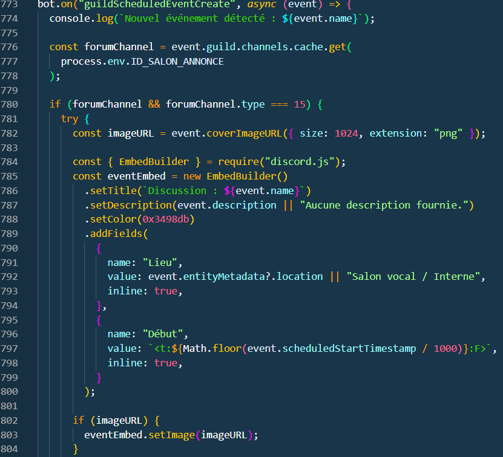
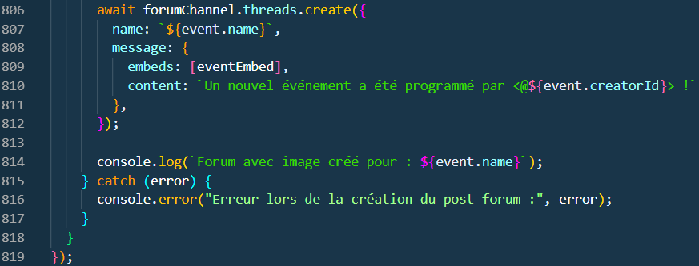

# Création de post quand Evenement crée

[page précédente](../dossier_technique/restriction.md)   [🏠](../)   [page suivante](../dossier_technique/error.md)

Comme c'est dit dans le titre le bout de code en dessous permet de créer un post lorsque qu'un événement est crée.

[page précédente](../dossier_technique/restriction.md)   [🏠](../)   [page suivante](../dossier_technique/evenement.md)