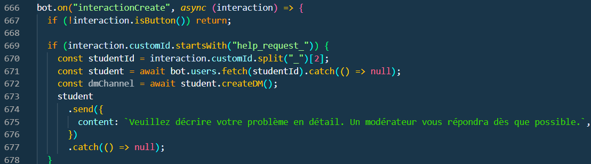
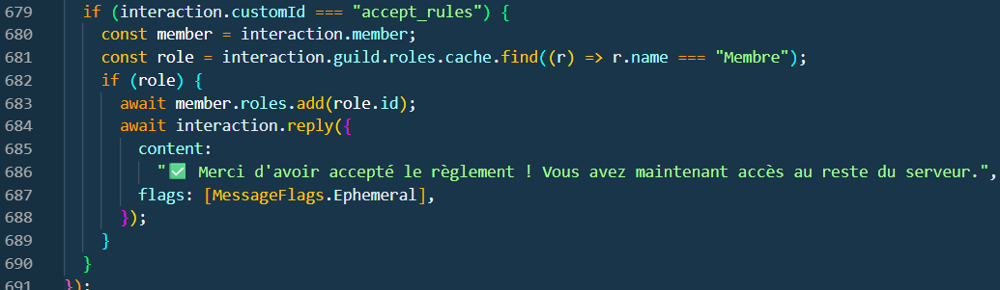

# Interaction avec les bouttons

[page précédente](../dossier_technique/reactions.md)   [🏠](../README.md)   [page suivante](../dossier_technique/memberadd.md)

## 1. Demande d'aide

ce qui suit, nous permet d'avoir le texte pour le forum (voir 1. dans le fichiers create.md) et le titre.

## 2. Acceptation des règles

Dans cette partie, nous pouvons voir que sa met le rôle "Membre" a tous ce qui clique sur le boutton d'acceptation

[page précédente](../dossier_technique/create.md)   [🏠](../README.md)   [page suivante](../dossier_technique/memberadd.md)