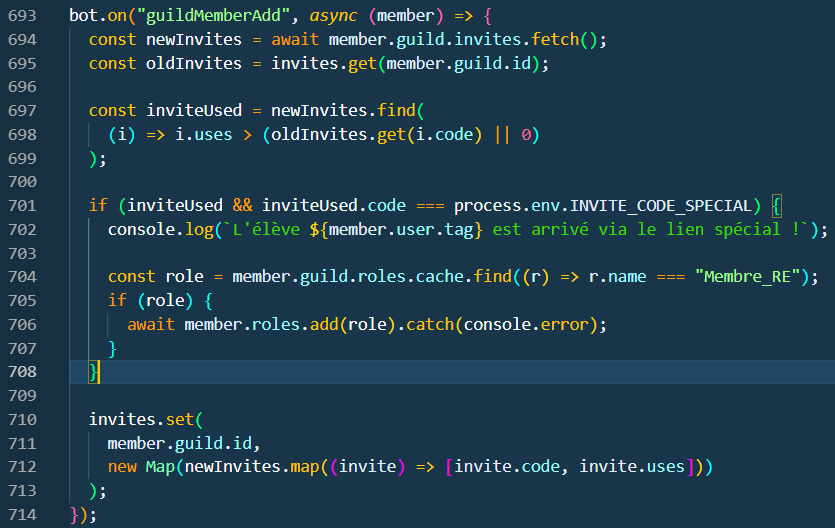

# Membre ajouté

[page précédente](../dossier_technique/interaction.md)   [🏠](../)   [page suivante](../)

Le bout de code qui suit permet au nouveau membre arrivé via un lien spéciale d'avoir sirect le role "Member_RE", qui permet d'avoir accés à la catégorie "RE"

[page précédente](../dossier_technique/interaction.md)   [🏠](../)   [page suivante](../)