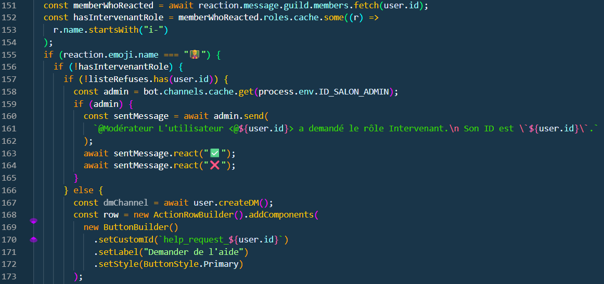
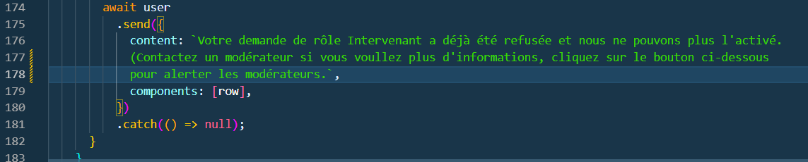
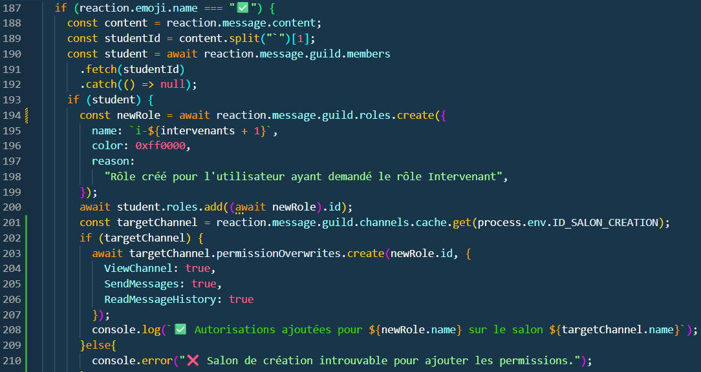
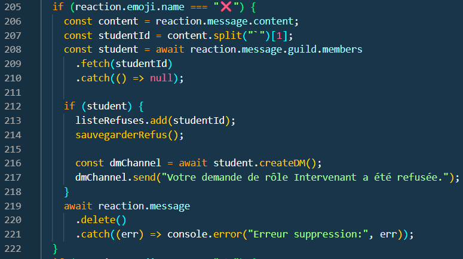
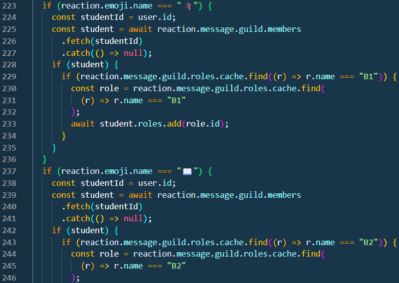
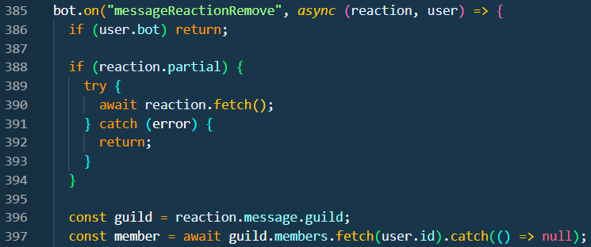
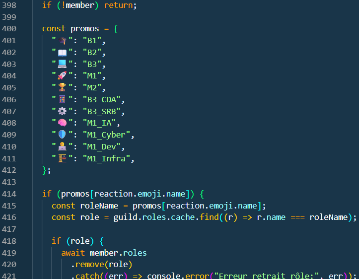
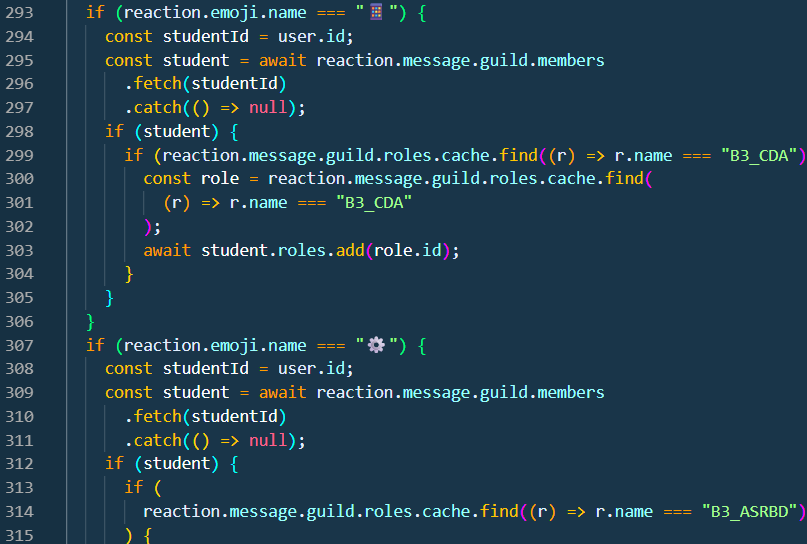
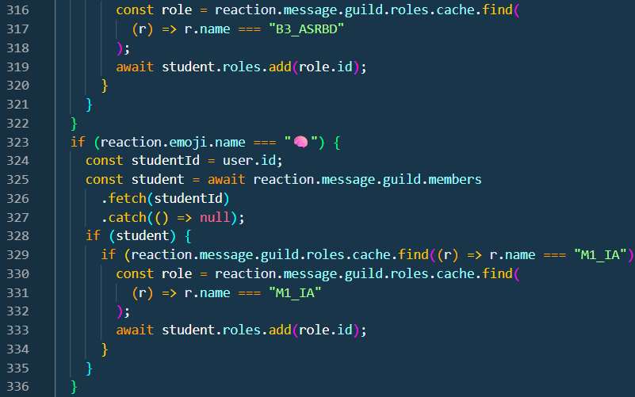
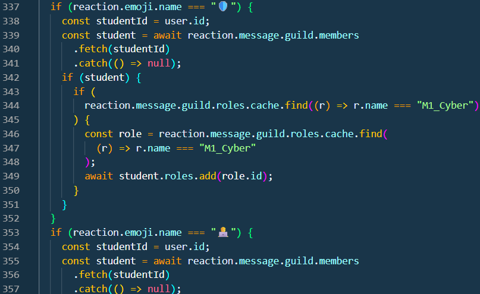

# Reactions au message

[page précédente](../dossier_technique/ready.md)   [🏠](../README.md)   [page suivante](../dossier_technique/create.md)

1. Intervenants :

Le code que nous voyons ci-dessous permet d'en un prmier temps de vérifier si le user n'a pas déjà le rôle ensuite de vérifiéer si le user n'est pas dans la liste des refusé.

Par la suite nous envoyons un message a l'user si il est dans la liste refusé pour lui dire qu'il a déjà été refusé et qu'il doit contacter les modérateurs pour plus d'informations.

2. Acceptée :

Dans le code on peut voir l'acceptation des modérateurs pour le rôle Intervenant.

3. Refussée :

Ensuite dans ce bout de code on vois le refus des modérateurs pour le rôle Interveant, et nous le sauvegardons dans une liste qui reste même si le bot se réinitialise.

4. Promos :

Dans le code qui suis nous avons mis en place le faite que si un user met un certains emoji il sera mis dans une promos spécifique.

Et on a fait la même chose pour les RE (Recherche d'Entreprise).

[page précédente](../dossier_technique/ready.md)   [🏠](../README.md)   [page suivante](../dossier_technique/create.md)