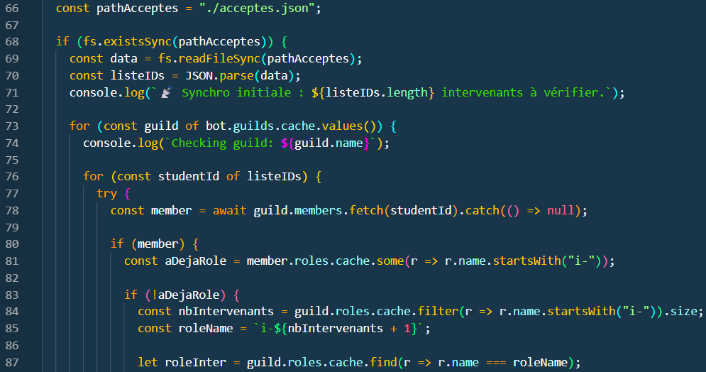
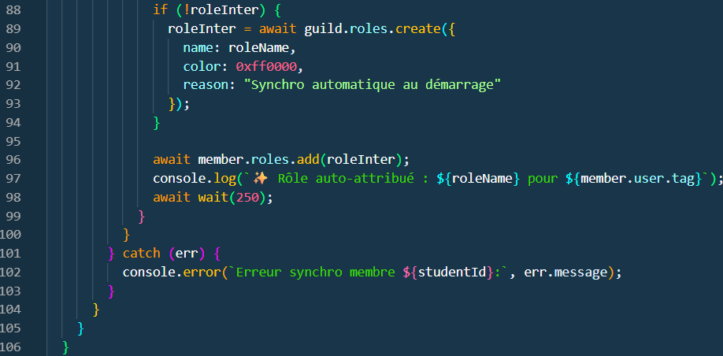
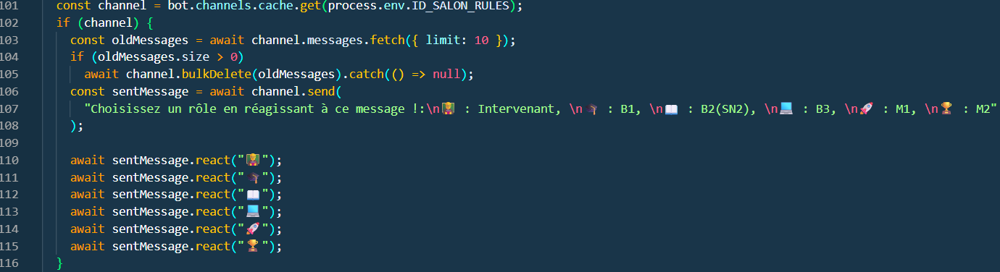
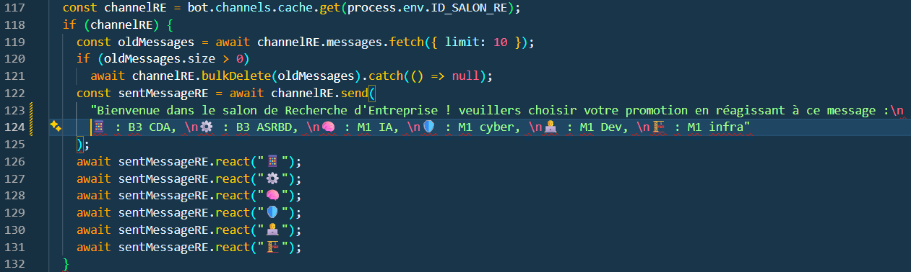

# Au lancement du Bot

[page précédente](../dossier_technique/implementation.md)   [🏠](../)   [page suivante](../dossier_technique/reactions.md)

## 1. Chargement des données:

Le code que nous allons voir permet de charger les données des intérvenant et de ce qui ont été refusé dans le nouveau bot.

## 2. Affichage des règles :

Le code ci-dessous permet d'afficher les règles mis en place pour le site de l'Epsi.

## 3. Affichage des rôles :

Ensuite nous avons le morceau de code qui permet d'afficher le choix des promos ou pour devenir intervenant.

## 4. Affichage des rôles pour les RE :

Par la suite nous pouvons voir que ce code fait la même chose que celui d'avant mais pour la RE (Recherche d'Entreprise).

[page précédente](../dossier_technique/implementation.md)   [🏠](../)   [page suivante](../dossier_technique/reactions.md)