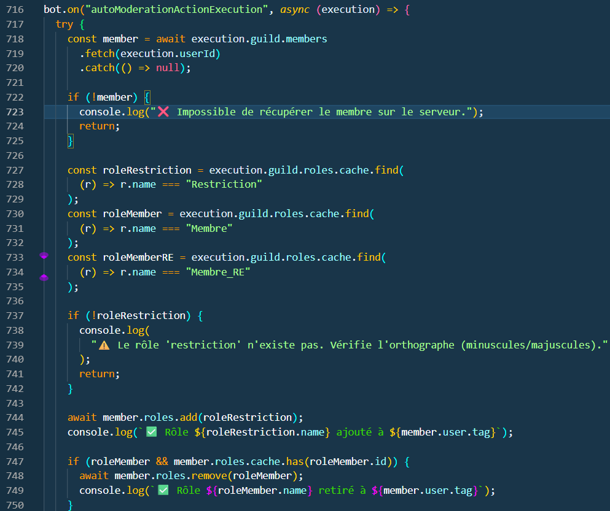
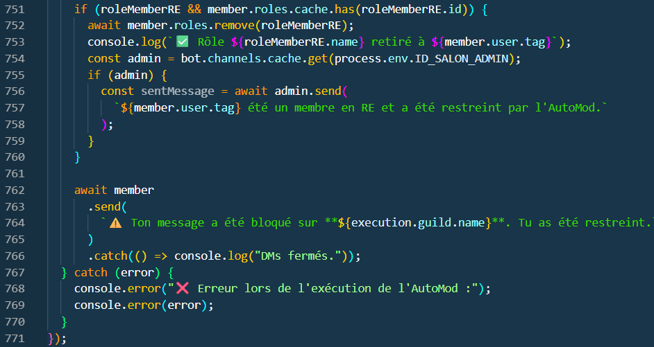

# Restriction

[page précédente](../dossier_technique/memberadd.md)   [🏠](../)   [page suivante](../dossier_technique/evenement.md)

Dans cette partie nous allons voir comment fonctionne le rôle de restriction.

Tout d'abord on a un bot qui s'appelle "AutoMod" qui est dans tous les seurveur discord qui gère les blocage de message. Nous avons donc mis en place une réaction de notre bot que quand il détecte le blocage il met a l'user le rôle restriction, ce qui se passe c'est que le user est restreint a 1 message par minutes et bien sur nous informons aussi les admin.

[page précédente](../dossier_technique/memberadd.md)   [🏠](../)   [page suivante](../dossier_technique/evenement.md)